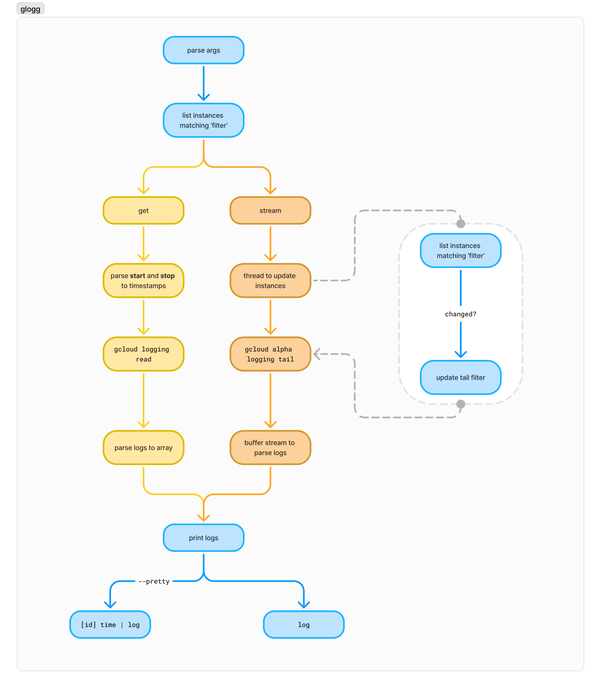

# Glögg

View Google Cloud Platform VM Instance logs based on a label attached to the service.


Glögg is a simple command-line tool for streaming or fetching Google Cloud logs from VM Compute instances based on a filter.

## Features

- Streaming: tail logs from instances by specifying a filter rather than individual instance IDs
- Fetch: Use the same filters to retrieve all logs between a start and stop time
- Real-Time Parsing: Stream logs directly from Google Cloud Logging, parse them as YAML, and highlight key information for quick readability.

## Prerequisites

Ensure the following are installed:

### Google Cloud CLI

[https://cloud.google.com/sdk/docs/install-sdk](https://cloud.google.com/sdk/docs/install-sdk)

### Google Cloud Alpha CLI

Installed on first use of `gcloud alpha`

```bash
gcloud alpha --help
```

### Python gRPC Module

```bash
pip install grpcio
```

## Authentication

Ensure you're authenticated with Google Cloud by running:

```bash
gcloud auth login
```

Also, set the default project for Google Cloud operations:

```bash
gcloud config set project <PROJECT_ID>
```

## Installation

Clone this repository:

```bash
git clone https://github.com/komment-ai/glogg.git
cd glogg
```

## Build the Rust project:

```bash
cargo build --release
```

## Architecture



## Usage

```bash
$ glogg --help
Usage: glogg [OPTIONS] --filter <FILTER>

Options:
  -f, --filter <FILTER>
  -p, --pretty
  -g, --get
      --start <START>
      --stop <STOP>
  -h, --help             Print help
```

Glogg accepts a filter query that it will run every 30 seconds to grab matching `instance_id`s and tail the logs, outputing a stream of the `json_payload.message` entries. If `--pretty` is specified, it will also include the instance_id and log time.

While we were at it, we also added a `--get` flag that returns all the logs matching the filter between the `start` and `stop` relative times.

## Examples

### Tailing

```
$ glogg --filter="labels.key=value"
Initializing tail session.
200 | GET    /index.html {}
304 | GET    /favicon.ico {}
:

```

### Pretty tailing

```sh
$ glogg --filter="labels.key=value" --pretty
Initializing tail session.
[3507962499726021919] 2024-11-03T18:44:31.319165623Z | 200 | GET    /index.html {}
[535389245885354883 ] 2024-11-03T18:44:31.746290301Z | 304 | GET    /favicon.ico {}
:

```

### Download logs for a time slice

```
$ glogg --filter="labels.key=value" --get --start -10m --stop -9m --pretty
[3507962499726021919] 2024-11-03T18:44:31.319165623Z | 200 | GET    /index.html {}
[535389245885354883 ] 2024-11-03T18:44:31.746290301Z | 304 | GET    /favicon.ico {}
```

## License

This project is licensed under the MIT License. See the LICENSE file for details.
